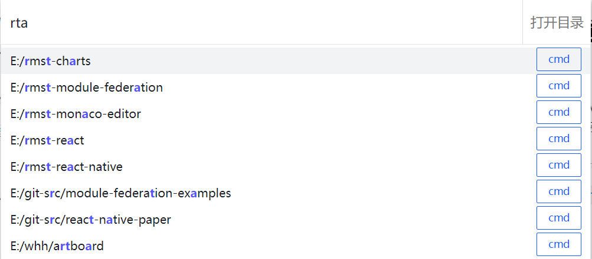

# windows 客户端

# 使用前需要设置一些基本数据

入口在托盘图标 鼠标右击 -> 设置

## 功能 1

- alt + 空格 在屏幕中间出现搜索框，进⾏跨字符的模糊搜索，回⻋键使⽤ vscode 打开本地硬盘中的项⽬

  - 同时也⽀持在命令⾏内快速打开项⽬路径

  

- alt + n 快速输⼊任意⽂本内容，⽐如邮箱，⼿机号等，相当于⼀键完成 ctrl+c , ctrl+v 的两步操作

> 在设置中保存的笔记列表在这里使用

